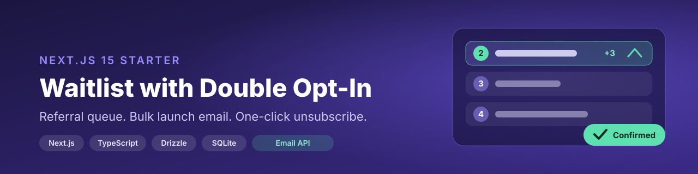
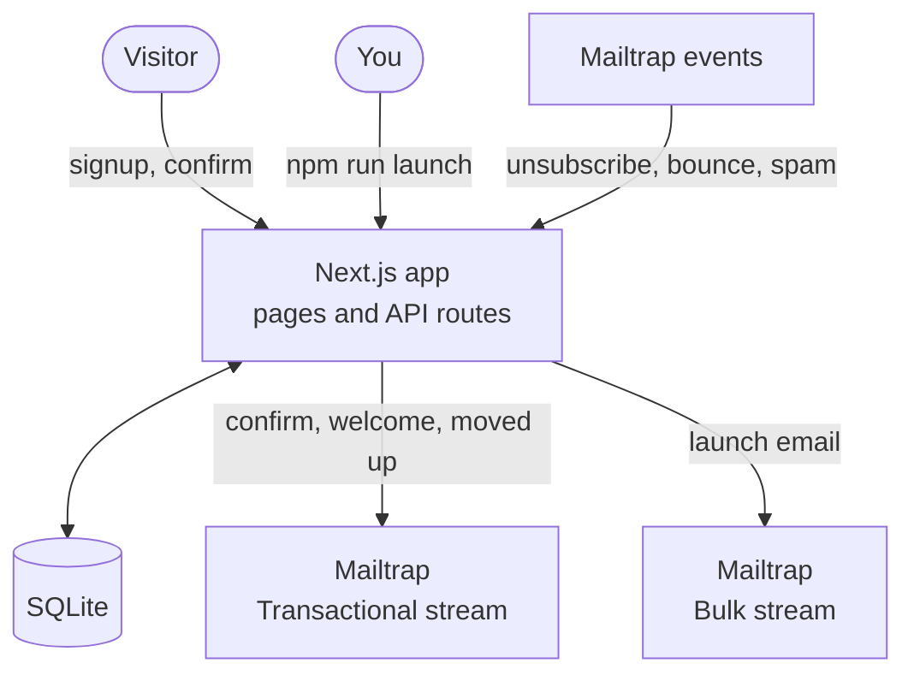
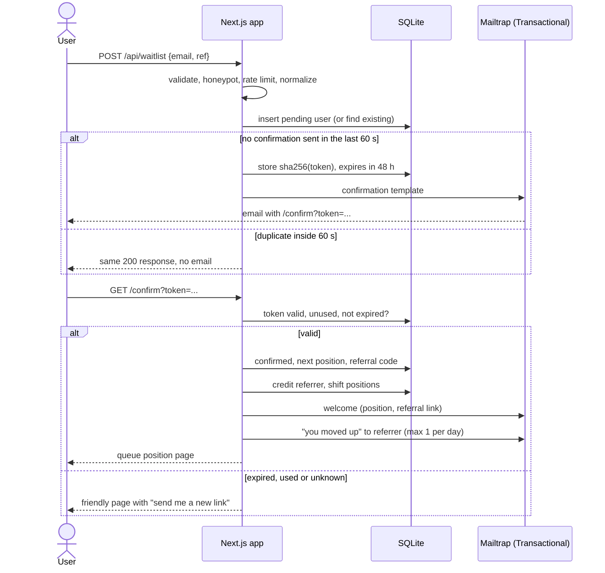

<p align="center">
  
</p>

# Next.js Waitlist with Double Opt-In, Referrals and Launch Email (Mailtrap)

A ready-to-deploy waitlist for your next launch, built with Next.js 15, TypeScript and Drizzle. Double opt-in keeps the list clean, referrals move people up the queue, and the launch announcement goes out on the Mailtrap Email API Bulk stream with one-click unsubscribe handled for you.

<p>
  <a href="https://github.com/Sid-Lais/nextjs-waitlist-double-opt-in/actions/workflows/ci.yml"></a>
  
  
  
  
</p>

[](https://vercel.com/new/clone?repository-url=https%3A%2F%2Fgithub.com%2FSid-Lais%2Fnextjs-waitlist-double-opt-in&env=APP_URL,DATABASE_URL,MAILTRAP_API_TOKEN,MAILTRAP_FROM_EMAIL,MAILTRAP_FROM_NAME,MAILTRAP_TEMPLATE_CONFIRM,MAILTRAP_TEMPLATE_WELCOME,MAILTRAP_TEMPLATE_MOVED_UP,MAILTRAP_TEMPLATE_LAUNCH,MAILTRAP_WEBHOOK_SECRET&envDescription=See%20.env.example%20for%20what%20each%20variable%20does&project-name=nextjs-waitlist-double-opt-in)

SQLite does not persist on Vercel. Read [Deploying to Vercel](#deploying-to-vercel) before you click.

**Contents:** [Features](#features) · [How it works](#how-it-works) · [Quick start](#quick-start) · [Configuration](#configuration) · [Transactional vs bulk](#transactional-vs-bulk) · [Launch email](#sending-the-launch-email) · [Webhooks](#webhooks) · [Referral queue](#referral-queue) · [Project structure](#project-structure) · [Tests](#tests) · [Deploying](#deploying-to-vercel) · [FAQ](#faq)

## Features

| | |
| --- | --- |
| **Clean signups** | Zod validation, honeypot field, per-IP rate limit, normalized email. A duplicate signup re-sends the confirmation instead of creating a second record, and never twice within 60 s. |
| **Double opt-in** | Signup is stored as pending with a hashed, single-use token (48 h). Nothing but the confirmation email is sent until the user clicks. |
| **Referral queue** | Confirming gives a position and a referral code. When a referred user confirms, the referrer moves up N places and gets a "you moved up" email, at most one per day. |
| **Bulk launch** | `npm run launch` sends through the Bulk stream in batches of up to 500, checks every message in the response and stores sent state per user, so reruns never email anyone twice. `--dry-run` prints counts and sends nothing. |
| **Suppression** | Webhook for `unsubscribe`, `bounce` and `spam_complaint` events, deduped on `event_id`. Marked users are skipped by every later send. |
| **Friendly failures** | An expired or reused link shows a page with a "send me a new link" button. |

## How it works

### Architecture

The app is a single Next.js project. Visitors use the web pages, the owner runs the launch from the command line, and Mailtrap sits on the other side for both sending and events. Everything is stored in one SQLite database.



| Part | What it does | Where |
| --- | --- | --- |
| Pages and API | Signup form, confirmation page, resend button | `src/app` |
| Waitlist service | Tokens, queue positions, referrals, moved-up emails | `src/lib/waitlist.ts` |
| Launch | Batches of up to 500 on the Bulk stream, per-user sent state | `src/lib/launch.ts` |
| Mailer | The only code that talks to Mailtrap | `src/lib/mailer.ts` |
| Webhook | Verifies the signature and marks unsubscribed, bounced and spam users | `src/lib/webhook.ts` |
| Database | Users, webhook event ids, rate limit counters | `src/lib/db` |

### Signup to welcome

This is the double opt-in path. A signup stays pending and gets only the confirmation email. The user is confirmed, queued and welcomed only after opening the link.



## Quick start

You need Node.js 20+ and a [Mailtrap](https://mailtrap.io) account with a verified sending domain.

```bash
git clone https://github.com/Sid-Lais/nextjs-waitlist-double-opt-in.git
cd nextjs-waitlist-double-opt-in
npm install
cp .env.example .env
```

1. In Mailtrap go to Settings, API Tokens, create a token with access to your sending domain. Put it in `MAILTRAP_API_TOKEN`.
2. Set `MAILTRAP_FROM_EMAIL` to an address on that domain.
3. Create the four email templates in your account and print their UUIDs:

   ```bash
   npm run templates:sync
   ```

   Paste the printed `MAILTRAP_TEMPLATE_*` lines into `.env`. The HTML lives in [`emails/`](emails) if you want to change it. Running the command again updates the same templates.
4. Start the app:

   ```bash
   npm run dev
   ```

The database is created at `./data/waitlist.db` on first request.

A Mailtrap demo domain only delivers to the account owner's own address. Use your own email while testing, or verify a real domain. To keep everything away from real recipients, set `MAILTRAP_ACCOUNT_ID` and `MAILTRAP_TEST_INBOX_ID` and all mail goes to that Email Testing inbox instead.

## Configuration

| Variable | Purpose |
| --- | --- |
| `APP_URL` | Public base URL, used in confirmation and referral links. |
| `DATABASE_URL` | SQLite file path. Default `./data/waitlist.db`. |
| `MAILTRAP_API_TOKEN` | Sending token. The same token is used for both streams. |
| `MAILTRAP_FROM_EMAIL`, `MAILTRAP_FROM_NAME` | Sender. The address must belong to a verified domain. |
| `MAILTRAP_TEMPLATE_CONFIRM`, `_WELCOME`, `_MOVED_UP`, `_LAUNCH` | Template UUIDs from `templates:sync`. |
| `MAILTRAP_WEBHOOK_SECRET` | Signing secret of the webhook that points at `/api/webhooks/mailtrap`. |
| `REFERRAL_BUMP_PLACES` | Places a referrer moves up per confirmed referral. Default 3. |
| `MAILTRAP_ACCOUNT_ID`, `MAILTRAP_TEST_INBOX_ID` | Optional. Send everything to an Email Testing inbox. The free plan allows about one email per 10 s, so sends are spaced out. |

## Transactional vs bulk

Confirmation, welcome and "you moved up" emails are one-to-one and triggered by something the user just did. They go through the Transactional stream (`send.api.mailtrap.io`). The launch announcement is the same message to your whole list, so it goes through the Bulk stream (`bulk.api.mailtrap.io`), which has separate reputation and is the right place for anything a recipient can unsubscribe from.

Each template carries a category, so the two streams are easy to tell apart in Mailtrap stats:

| Email | Stream | Category |
| --- | --- | --- |
| Confirm | Transactional | `waitlist-confirm` |
| Welcome | Transactional | `waitlist-welcome` |
| Moved up | Transactional | `waitlist-moved-up` |
| Launch | Bulk | `waitlist-launch` |

## Sending the launch email

```bash
npm run launch -- --dry-run   # prints counts, sends nothing
npm run launch                # sends
```

The dry run prints how many confirmed users there are, how many are skipped and why (unsubscribed, bounced, spam report, already sent), and how many batches would go out.

How a run behaves:

- Only confirmed users who are not unsubscribed, bounced or marked as spam are included. Pending signups never get the launch email.
- Users are sent in batches of at most 500. Before a batch goes out its users are marked `sending`, and suppression is checked again at that moment.
- The response for every message is checked. A message that Mailtrap rejects is marked `failed` with the error and retried on the next run. Accepted ones are marked `sent` with the Mailtrap message id and never sent again.
- If the whole request is refused (HTTP 4xx), the batch is marked `failed` and the run moves on.
- If the outcome of a request is unknown (timeout, network error, 5xx), the run stops and leaves that batch as `sending`. The next run skips those users and reports how many. Check the Mailtrap email logs. If they were not delivered, run `npm run launch -- --retry-unknown`. Skipping by default is what guarantees nobody gets two emails.

The launch template contains `__unsubscribe_url__`. Mailtrap replaces it and adds the `List-Unsubscribe` headers, so one-click unsubscribe works without a login.

## Webhooks

In Mailtrap go to Settings, Webhooks, add a webhook for your sending domain pointing at `https://YOUR_APP/api/webhooks/mailtrap`, and select the `unsubscribe`, `bounce` and `spam complaint` events. Copy its signing secret into `MAILTRAP_WEBHOOK_SECRET`.

The endpoint verifies the `Mailtrap-Signature` HMAC over the raw body, ignores event ids it has already seen, and sets `unsubscribed_at`, `bounced_at` or `spam_at` on the matching user. Without a secret it refuses all requests.

To try it locally without a tunnel:

```bash
npm run webhook:test -- someone@example.com unsubscribe
```

## Referral queue

Positions are dense numbers 1..n among confirmed users, assigned in confirmation order. When a referred user confirms, the referrer's position drops by `REFERRAL_BUMP_PLACES` (never above #1) and everyone in between moves down one. A referral is credited once per referred user, only on confirmation, and never for self referrals or unconfirmed referrers.

The confirmation link confirms on `GET`, as the flow requires. Some corporate mail scanners open links before the user does, which uses up the token. The "send me a new link" button on the error page covers that case.

## Project structure

```text
.
├── docs/
│   └── banner.svg               README banner
├── drizzle/                     generated SQL migrations (applied on first connect)
├── emails/                      HTML and text for the four Mailtrap templates
│   ├── confirm.*  welcome.*  moved_up.*
│   └── launch.*                 contains __unsubscribe_url__
├── scripts/
│   ├── launch.ts                npm run launch
│   ├── sync-templates.ts        npm run templates:sync
│   ├── test-webhook.ts          npm run webhook:test
│   └── e2e.ts                   npm run e2e
├── src/
│   ├── app/
│   │   ├── page.tsx             landing page and form
│   │   ├── confirm/             GET /confirm and the friendly error page
│   │   ├── check-email/         after "send me a new link"
│   │   └── api/
│   │       ├── waitlist/        POST signup, resend/ for the new-link button
│   │       └── webhooks/mailtrap/
│   └── lib/
│       ├── waitlist.ts          signup, confirm, referral math, moved-up email
│       ├── launch.ts            bulk launch, chunking, skip logic
│       ├── mailer.ts            Mailtrap client, both streams, error classes
│       ├── webhook.ts           signature check, dedupe, suppression
│       ├── tokens.ts            token and referral code generation, hashing
│       ├── validation.ts        zod schema, email normalization
│       ├── rate-limit.ts        per-IP counter stored in the database
│       ├── config.ts  context.ts
│       └── db/                  Drizzle schema and connection
├── tests/                       vitest suites
└── .github/workflows/ci.yml     lint, typecheck, test, build
```

The services in `src/lib` take their database, mailer, clock and config as arguments. That is what lets the tests run against an in-memory database and a fake mailer, with no Mailtrap account.

## Tests

```bash
npm test            # unit tests, no credentials needed
npm run lint
npm run typecheck
```

The unit tests replace the email layer with a fake that records messages. They cover validation, duplicates and the 60 s window, token expiry and reuse, referral position math, the daily cap on "moved up" emails, launch skip logic and idempotency, stream selection and webhook signature and dedupe.

### End-to-end

`npm run e2e` drives a running app and the real Mailtrap API. Mail goes to an Email Testing inbox, so no real recipient is emailed. It signs users up, reads the confirmation links out of the inbox, confirms, checks the referral move and the emails sent, fires signed webhooks, runs `launch --dry-run`, `launch` and a second `launch`, and verifies nobody was emailed twice.

```bash
# .env needs MAILTRAP_ACCOUNT_ID, MAILTRAP_TEST_INBOX_ID and MAILTRAP_WEBHOOK_SECRET
npm run build
DATABASE_URL=./data/e2e.db APP_URL=http://localhost:3100 npx next start -p 3100
# in a second terminal
DATABASE_URL=./data/e2e.db APP_URL=http://localhost:3100 npm run e2e
```

The free sandbox plan limits sending to about one email per 10 s and rate-limits single messages inside a batch. The run therefore takes several minutes, and the launch step usually fails partly and is rerun until done. That doubles as a check that a partial failure never emails anyone twice. The sandbox also leaves `__unsubscribe_url__` as literal text, because only the live Bulk stream replaces it, so the unsubscribe link itself can only be checked with a verified sending domain. A full run uses about 20 of the 50 free sandbox messages per month.

## Deploying to Vercel

SQLite writes to local disk, and a Vercel function's disk is not persistent, so signups would vanish between invocations. For a real deployment switch to Postgres (for example Neon):

1. Install `pg` or `@neondatabase/serverless` and use `drizzle-orm/node-postgres` or `drizzle-orm/neon-http` in `src/lib/db/index.ts`.
2. Port `src/lib/db/schema.ts` from `sqlite-core` to `pg-core` and regenerate migrations with `npm run db:generate`.
3. The code uses synchronous `db.transaction` calls from better-sqlite3. With Postgres these become async and the `.get()` and `.run()` calls turn into awaited queries.

For a quick demo on Vercel you can set `DATABASE_URL=/tmp/waitlist.db`, which works per instance but loses data.

Set the webhook URL to your deployed domain and run `npm run launch` from your own machine with the production `DATABASE_URL`, or from a one-off job.

The signup and resend limits read the client IP from `x-forwarded-for`, which Vercel and most proxies set. Behind no proxy, every request shares one bucket.

## FAQ

### How do I add double opt-in to a Next.js waitlist?

Store the signup as pending and never email anything except a confirmation. Generate a random token, store only its hash with an expiry, and email the raw token as a link. When the link is opened, check the hash and the expiry, mark the token used and switch the user to confirmed. This repo does exactly that in `src/lib/waitlist.ts`.

### How do I send a launch email to my whole waitlist without hurting deliverability?

Send only to confirmed addresses, use the Bulk stream, include an unsubscribe link, and skip anyone who unsubscribed, bounced or complained. Send in batches and record the result per recipient so a failed run can resume without repeating. `npm run launch` does this, and `--dry-run` shows the numbers first.

### What's the difference between transactional and bulk email?

Transactional email is one message triggered by an action, such as a confirmation or a receipt. Bulk email is the same message to many people, such as an announcement. Providers keep them on separate streams so a bulk campaign with a few complaints doesn't affect the delivery of your confirmation emails.

### How do I handle unsubscribes and bounces from a launch email?

Put `__unsubscribe_url__` in the bulk template so Mailtrap adds the unsubscribe link and headers, then receive Mailtrap's `unsubscribe`, `bounce` and `spam_complaint` webhook events. This repo marks the user and every later send skips them.

## License

[MIT](LICENSE)
