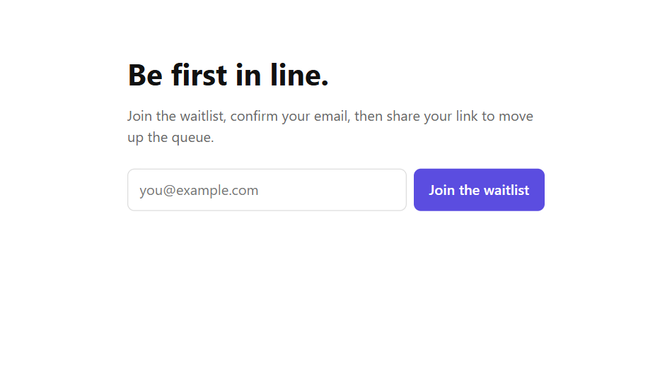
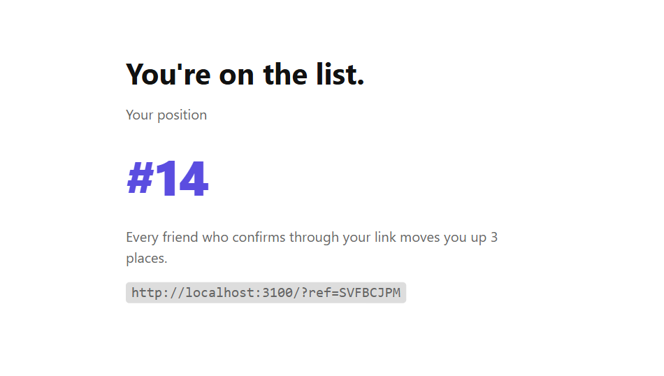
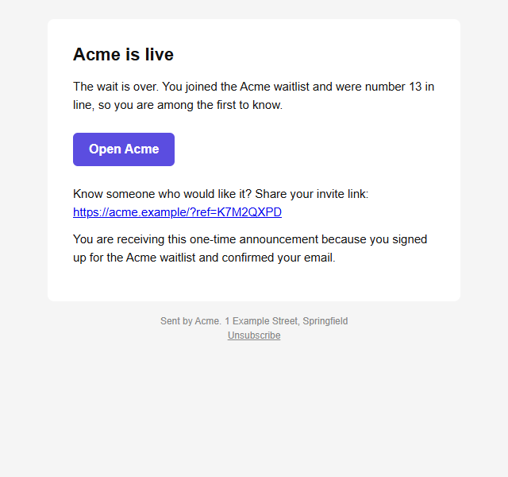
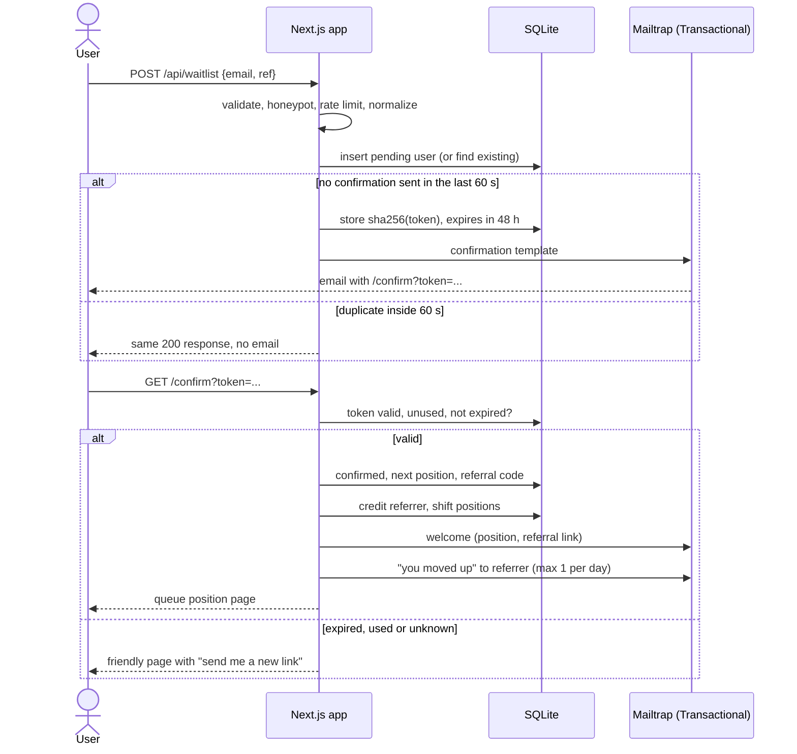

<p align="center">
  
</p>

# Next.js Waitlist with Double Opt-In, Referrals and Launch Email (Mailtrap)

A ready-to-deploy waitlist for your next launch, built with Next.js 15, TypeScript and Drizzle. Double opt-in keeps the list clean, referrals move people up the queue, and the launch announcement goes out on the Mailtrap Email API Bulk stream with one-click unsubscribe handled for you.

<p>
  <a href="https://github.com/Sid-Lais/nextjs-waitlist-double-opt-in/actions/workflows/ci.yml"></a>
  
  
  
  
</p>

[](https://vercel.com/new/clone?repository-url=https%3A%2F%2Fgithub.com%2FSid-Lais%2Fnextjs-waitlist-double-opt-in&env=APP_URL,DATABASE_URL,MAILTRAP_API_TOKEN,MAILTRAP_FROM_EMAIL,MAILTRAP_FROM_NAME,MAILTRAP_TEMPLATE_CONFIRM,MAILTRAP_TEMPLATE_WELCOME,MAILTRAP_TEMPLATE_MOVED_UP,MAILTRAP_TEMPLATE_LAUNCH,MAILTRAP_WEBHOOK_SECRET&envDescription=See%20.env.example%20for%20what%20each%20variable%20does&project-name=nextjs-waitlist-double-opt-in)

SQLite does not persist on Vercel. Read [Deploying to Vercel](#deploying-to-vercel) before you click.

**Contents:** [Demo](#demo) · [How it works](#how-it-works) · [Features](#features) · [Stack](#stack) · [Prerequisites](#prerequisites) · [Mailtrap setup](#mailtrap-setup) · [Quick start](#quick-start) · [Key integration points](#key-integration-points) · [Failure behavior](#failure-behavior) · [Configuration](#configuration) · [Tests](#tests) · [Deploying](#deploying-to-vercel) · [Links](#links) · [FAQ](#faq)

## Demo

| Landing page                                                                         | Confirmed, with queue position                                                                                    | Launch email (rendered template)                                                                                       |
| ------------------------------------------------------------------------------------ | ----------------------------------------------------------------------------------------------------------------- | ---------------------------------------------------------------------------------------------------------------------- |
|  |  |  |

The screenshots come from a local run. The email is `emails/launch.html` rendered with sample values.

## How it works

The app is a single Next.js project. Visitors use the web pages, you run the launch from the command line, and Mailtrap sits on the other side for both sending and events. Everything is stored in one SQLite database.


| Part             | What it does                                                          | Where                 |
| ---------------- | --------------------------------------------------------------------- | --------------------- |
| Pages and API    | Signup form, confirmation page, resend button                         | `src/app`             |
| Waitlist service | Tokens, queue positions, referrals, moved-up emails                   | `src/lib/waitlist.ts` |
| Launch           | Batches of up to 500 on the Bulk stream, per-user sent state          | `src/lib/launch.ts`   |
| Mailer           | The only code that talks to Mailtrap                                  | `src/lib/mailer.ts`   |
| Webhook          | Verifies the signature and marks unsubscribed, bounced and spam users | `src/lib/webhook.ts`  |
| Database         | Users, webhook event ids, rate limit counters                         | `src/lib/db`          |

### Signup to welcome

This is the double opt-in path. A signup stays pending and gets only the confirmation email. The user is confirmed, queued and welcomed only after opening the link.



## Features

- **Clean signups.** Zod validation, honeypot field, per-IP rate limit, normalized email. A duplicate signup re-sends the confirmation instead of creating a second record, and never twice within 60 s.
- **Double opt-in.** Signup is stored as pending with a hashed, single-use token (48 h). Nothing but the confirmation email is sent until the user clicks.
- **Referral queue.** Confirming gives a position and a referral code. When a referred user confirms, the referrer moves up N places and gets a "you moved up" email, at most one per day.
- **Bulk launch.** `npm run launch` sends through the Bulk stream in batches of up to 500, checks every message in the response and stores sent state per user. `--dry-run` prints counts and sends nothing.
- **Suppression.** A webhook for `unsubscribe`, `bounce` and `spam` events, deduped on `event_id`. Marked users are skipped by every later send.
- **Friendly failures.** An expired or reused link shows a page with a "send me a new link" button.

## Stack

|            |                                                                                                                                         |
| ---------- | --------------------------------------------------------------------------------------------------------------------------------------- |
| App        | Next.js 15 (App Router), React 19, TypeScript                                                                                           |
| Data       | Drizzle ORM, SQLite (better-sqlite3)                                                                                                    |
| Validation | Zod                                                                                                                                     |
| Email      | [`mailtrap`](https://github.com/railsware/mailtrap-nodejs) Node.js SDK: Transactional and Bulk streams, templates, batch send, webhooks |
| Tooling    | Vitest, ESLint, Prettier, GitHub Actions                                                                                                |

## Prerequisites

- Node.js 20 or newer
- A [Mailtrap](https://mailtrap.io) account (the free plan is enough to try everything)

## Mailtrap setup

1. **Create an API token.** In Mailtrap go to Settings, API Tokens, and create a token with access to your sending domain. One token works for both streams.
2. **First run on the demo domain.** New accounts get a demo sending domain, `demomailtrap.co`. Send from `hello@demomailtrap.co` and use your own account email as the recipient. The demo domain delivers only to the account owner, so this is a safe way to see the whole flow without touching real addresses. Mail from a shared demo domain often lands in spam.
3. **Verify your own domain to email anyone.** Add your domain under Sending Domains and create the DNS records Mailtrap shows (SPF, DKIM, and a DMARC record). Then set `MAILTRAP_FROM_EMAIL` to an address on it.
4. **Use a separate subdomain for the launch.** A recipient who unsubscribes is suppressed for that sending domain on the Bulk stream. Send the launch from something like `news.your-domain.com` and set `MAILTRAP_BULK_FROM_EMAIL` to an address there, so an unsubscribe cannot affect your main domain. The Transactional stream keeps its own suppression list.
5. **Know the free plan limits.** The free plan allows 4,000 emails a month and 150 a day. Anything over the daily limit is rejected. New accounts are also limited to 150 emails an hour, and extra mail is queued for later hours. See [Mailtrap sending limits](https://docs.mailtrap.io/email-api-smtp/setup/sending-limits).

## Quick start

```bash
git clone https://github.com/Sid-Lais/nextjs-waitlist-double-opt-in.git && cd nextjs-waitlist-double-opt-in
npm install
cp .env.example .env        # set MAILTRAP_API_TOKEN and MAILTRAP_FROM_EMAIL
npm run templates:sync      # creates the 4 templates, prints their UUIDs for .env
npm run dev
```

Open http://localhost:3000. The database is created at `./data/waitlist.db` on the first request. The template HTML lives in [`emails/`](emails), and running `templates:sync` again updates the same templates.

## Key integration points

**Two streams, one token.** The SDK picks the host from the `bulk` flag. Transactional goes to `send.api.mailtrap.io`, bulk to `bulk.api.mailtrap.io`, and the launch is one `batchSend` call per chunk of at most 500 ([`src/lib/mailer.ts`](src/lib/mailer.ts)):

```ts
const transactional = new MailtrapClient({ token });
const bulk = new MailtrapClient({ token, bulk: true });

const res = await bulk.batchSend({
  base: { from: bulkFrom, template_uuid: templates.launch },
  requests: msgs.map((m) => ({ to: [{ email: m.to }], template_variables: m.variables })),
});
```

**Check every message in the response.** A batch can return HTTP 200 while single messages inside it fail. The launch maps each response to its user and stores the result, so a rerun only retries failures ([`src/lib/mailer.ts`](src/lib/mailer.ts)):

```ts
if (!Array.isArray(res.responses) || res.responses.length !== msgs.length) {
  throw new AmbiguousError(
    `Expected ${msgs.length} responses, got ${res.responses?.length ?? "none"}`,
  );
}
return res.responses.map((r) =>
  r.success && r.message_ids?.[0]
    ? { ok: true as const, messageId: r.message_ids[0] }
    : { ok: false as const, error: r.errors?.join("; ") || "unknown error" },
);
```

**Verify webhooks on the raw body.** Mailtrap signs the exact bytes it sends. Read the body as text, verify, and only then parse ([`src/lib/webhook.ts`](src/lib/webhook.ts)):

```ts
import { verifyWebhookSignature } from "mailtrap";

if (!signature || !verifyWebhookSignature(rawBody, signature, secret)) {
  return { status: 401, error: "bad signature" };
}
```

**Unsubscribe without writing a page.** The launch template contains `__unsubscribe_url__` ([`emails/launch.html`](emails/launch.html)). Mailtrap replaces it on the Bulk stream and adds the `List-Unsubscribe` headers.

## Failure behavior

What happens when something goes wrong, so you know what to expect before launch day.

| Situation                                                                  | What the app does                                                                                                                                                                                                                                                            |
| -------------------------------------------------------------------------- | ---------------------------------------------------------------------------------------------------------------------------------------------------------------------------------------------------------------------------------------------------------------------------- |
| Confirmation email fails to send                                           | The user sees "We couldn't send the email, try again" (HTTP 502) and can retry at once. The 60 s cooldown is released.                                                                                                                                                       |
| Welcome or "moved up" email fails                                          | Logged. The signup or referral still counts.                                                                                                                                                                                                                                 |
| Same email submitted twice                                                 | One record. A second confirmation is sent only after 60 s, and the older link stops working.                                                                                                                                                                                 |
| Expired or reused link                                                     | A friendly page with a "send me a new link" button. A confirmed user asking for a new link gets nothing sent.                                                                                                                                                                |
| A launch message is rejected                                               | That user is marked `failed` with the error and retried on the next `npm run launch`. Users already `sent` are never sent again.                                                                                                                                             |
| The whole launch request is refused (HTTP 4xx)                             | The batch is marked `failed` and the run moves on.                                                                                                                                                                                                                           |
| The outcome is unknown (timeout, network error, 5xx, wrong response count) | The run stops and leaves that batch as `sending`. The next run skips those users and reports how many. Check the Mailtrap email logs, and if they were not delivered run `npm run launch -- --retry-unknown`. Skipping by default is what guarantees nobody gets two emails. |
| Daily or hourly plan limit hit during launch                               | Messages over the daily limit come back rejected and are retried on the next run. Plan around 150 a day on the free plan.                                                                                                                                                    |
| A user unsubscribes, bounces or reports spam mid-launch                    | Suppression is checked again when a batch is claimed, so they are skipped.                                                                                                                                                                                                   |
| Webhook delivered twice                                                    | Deduped on `event_id`.                                                                                                                                                                                                                                                       |
| Webhook with a bad or missing signature, or no secret set                  | Refused with 401 or 503.                                                                                                                                                                                                                                                     |

## Sending the launch email

```bash
npm run launch -- --dry-run   # prints counts, sends nothing
npm run launch                # sends
```

The dry run prints how many confirmed users there are, how many are skipped and why (unsubscribed, bounced, spam report, already sent), and how many batches would go out. On the free plan a list over 150 will not go out in one day, so run the launch again the next day. Users already sent are skipped.

Only confirmed users who are not unsubscribed, bounced or marked as spam are included, and pending signups never get the launch email.

### Webhooks

In Mailtrap go to Webhooks, create one for your sending domain on the Bulk stream pointing at `https://YOUR_APP/api/webhooks/mailtrap`, and select the unsubscribe, bounce and spam complaint events. Copy its signing secret into `MAILTRAP_WEBHOOK_SECRET`. The endpoint accepts both payload formats, JSON and JSON Lines. In the payload the spam event is named `spam`.

The endpoint verifies the `Mailtrap-Signature` HMAC over the raw body, ignores event ids it has already seen, and sets `unsubscribed_at`, `bounced_at` or `spam_at` on the matching user. To try it locally without a tunnel:

```bash
npm run webhook:test -- someone@example.com unsubscribe
```

### Referral queue

Positions are dense numbers 1..n among confirmed users, assigned in confirmation order. When a referred user confirms, the referrer's position drops by `REFERRAL_BUMP_PLACES` (never above #1) and everyone in between moves down one. A referral is credited once per referred user, only on confirmation, and never for self referrals or unconfirmed referrers.

The confirmation link confirms on `GET`. Some corporate mail scanners open links before the user does, which uses up the token. The "send me a new link" button on the error page covers that case.

## Configuration

| Variable                                                        | Purpose                                                                                                                                |
| --------------------------------------------------------------- | -------------------------------------------------------------------------------------------------------------------------------------- |
| `APP_URL`                                                       | Public base URL, used in confirmation and referral links. Use your real `https` URL in production.                                     |
| `DATABASE_URL`                                                  | SQLite file path. Default `./data/waitlist.db`.                                                                                        |
| `MAILTRAP_API_TOKEN`                                            | Sending token. The same token is used for both streams.                                                                                |
| `MAILTRAP_FROM_EMAIL`, `MAILTRAP_FROM_NAME`                     | Sender for transactional email. The address must belong to a verified domain. The name is also used as the product name in the emails. |
| `MAILTRAP_BULK_FROM_EMAIL`                                      | Optional sender for the launch email, ideally on a separate subdomain. Defaults to `MAILTRAP_FROM_EMAIL`.                              |
| `MAILTRAP_TEMPLATE_CONFIRM`, `_WELCOME`, `_MOVED_UP`, `_LAUNCH` | Template UUIDs from `templates:sync`.                                                                                                  |
| `MAILTRAP_WEBHOOK_SECRET`                                       | Signing secret of the webhook that points at `/api/webhooks/mailtrap`.                                                                 |
| `REFERRAL_BUMP_PLACES`                                          | Places a referrer moves up per confirmed referral. Default 3.                                                                          |
| `POSTAL_ADDRESS`                                                | Optional. Shown in the email footers. Bulk senders should include one.                                                                 |
| `LAUNCH_URL`                                                    | Where the launch email button points. Defaults to `APP_URL`.                                                                           |

Each template carries a category, so the two streams are easy to tell apart in Mailtrap stats:

| Email    | Stream        | Category            |
| -------- | ------------- | ------------------- |
| Confirm  | Transactional | `waitlist-confirm`  |
| Welcome  | Transactional | `waitlist-welcome`  |
| Moved up | Transactional | `waitlist-moved-up` |
| Launch   | Bulk          | `waitlist-launch`   |

## Project structure

```text
.
├── docs/                        banner, demo screenshots, social preview
├── drizzle/                     generated SQL migrations (applied on first connect)
├── emails/                      HTML and text for the four Mailtrap templates
├── scripts/
│   ├── launch.ts                npm run launch
│   ├── sync-templates.ts        npm run templates:sync
│   └── test-webhook.ts          npm run webhook:test
├── src/
│   ├── app/
│   │   ├── page.tsx             landing page and form
│   │   ├── confirm/             GET /confirm and the friendly error page
│   │   ├── check-email/         after "send me a new link"
│   │   └── api/
│   │       ├── waitlist/        POST signup, resend/ for the new-link button
│   │       └── webhooks/mailtrap/
│   └── lib/
│       ├── waitlist.ts          signup, confirm, referral math, moved-up email
│       ├── launch.ts            bulk launch, chunking, skip logic
│       ├── mailer.ts            Mailtrap client, both streams, error classes
│       ├── webhook.ts           signature check, dedupe, suppression
│       ├── tokens.ts            token and referral code generation, hashing
│       ├── validation.ts        zod schema, email normalization
│       ├── rate-limit.ts        per-IP counter stored in the database
│       ├── config.ts  context.ts
│       └── db/                  Drizzle schema and connection
├── tests/                       vitest suites
└── .github/workflows/ci.yml     format, lint, typecheck, test, build
```

The services in `src/lib` take their database, mailer, clock and config as arguments. That is what lets the tests run against an in-memory database and a fake mailer, with no Mailtrap account.

## Tests

```bash
npm test               # unit tests, no credentials needed
npm run lint
npm run typecheck
npm run format:check
```

The email layer is replaced by a fake that records messages. The tests cover validation, duplicates and the 60 s window, token expiry and reuse, referral position math, the daily cap on "moved up" emails, launch skip logic and idempotency, stream and sender selection, and webhook signature, dedupe and both payload formats.

## Deploying to Vercel

SQLite writes to local disk, and a Vercel function's disk is not persistent, so signups would vanish between invocations. For a real deployment switch to Postgres (for example Neon):

1. Install `pg` or `@neondatabase/serverless` and use `drizzle-orm/node-postgres` or `drizzle-orm/neon-http` in `src/lib/db/index.ts`.
2. Port `src/lib/db/schema.ts` from `sqlite-core` to `pg-core` and regenerate migrations with `npm run db:generate`.
3. The code uses synchronous `db.transaction` calls from better-sqlite3. With Postgres these become async and the `.get()` and `.run()` calls turn into awaited queries.

For a quick demo on Vercel you can set `DATABASE_URL=/tmp/waitlist.db`, which works per instance but loses data.

Set the webhook URL to your deployed domain and run `npm run launch` from your own machine with the production `DATABASE_URL`, or from a one-off job. The signup and resend limits read the client IP from `x-forwarded-for`, which Vercel and most proxies set. Behind no proxy, every request shares one bucket.

## Links

- [Mailtrap Node.js SDK](https://github.com/railsware/mailtrap-nodejs)
- [Bulk stream](https://docs.mailtrap.io/email-api-smtp/setup/bulk-stream)
- [Email templates](https://docs.mailtrap.io/email-api-smtp/email-templates)
- [Webhooks](https://docs.mailtrap.io/email-api-smtp/advanced/webhooks)
- [Sending limits](https://docs.mailtrap.io/email-api-smtp/setup/sending-limits)
- [Mailtrap Next.js SaaS starter](https://github.com/mailtrap/nextjs-saas-starter), the reference for how Mailtrap is used in a Next.js app

## FAQ

### How do I add double opt-in to a Next.js waitlist?

Store the signup as pending and never email anything except a confirmation. Generate a random token, store only its hash with an expiry, and email the raw token as a link. When the link is opened, check the hash and the expiry, mark the token used and switch the user to confirmed. This repo does exactly that in `src/lib/waitlist.ts`.

### How do I send a launch email to my whole waitlist without hurting deliverability?

Send only to confirmed addresses, use the Bulk stream, include an unsubscribe link, and skip anyone who unsubscribed, bounced or complained. Send in batches and record the result per recipient so a failed run can resume without repeating. `npm run launch` does this, and `--dry-run` shows the numbers first.

### What's the difference between transactional and bulk email?

Transactional email is one message triggered by an action, such as a confirmation or a receipt. Bulk email is the same message to many people, such as an announcement. Providers keep them on separate streams so a bulk campaign with a few complaints doesn't affect the delivery of your confirmation emails.

### How do I handle unsubscribes and bounces from a launch email?

Put `__unsubscribe_url__` in the bulk template so Mailtrap adds the unsubscribe link and headers, then receive Mailtrap's `unsubscribe`, `bounce` and `spam` webhook events. This repo marks the user and every later send skips them.

## License

[MIT](LICENSE)
